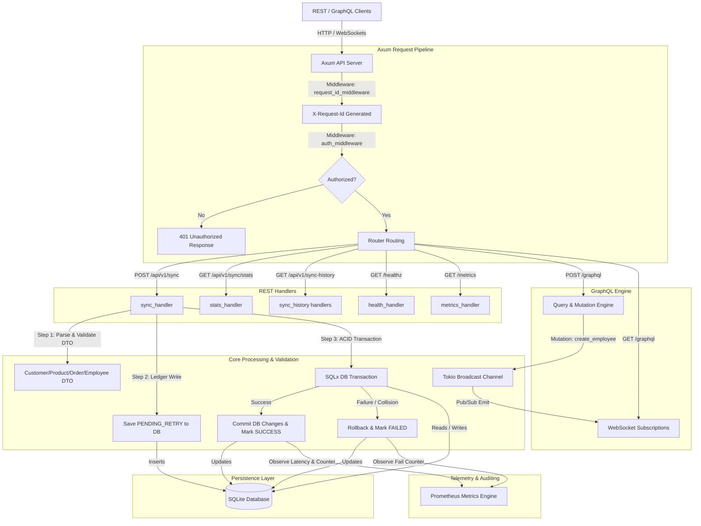

# 🦀 Sync Bridge Rust (Axum)

[](https://www.rust-lang.org/)
[](https://github.com/tokio-rs/axum)
[](https://async-graphql.github.io/)
[-blue.svg?style=for-the-badge&logo=sqlite)](https://github.com/launchbadge/sqlx)

A high-performance, asynchronous, secure, and ultra-scalable Rust port of the **Sync Bridge** API. This service mirrors the synchronization logic of the original Java Spring Boot implementation, optimizing CPU utilization, memory footprint, and transaction safety through Rust's compile-time guarantees.

---

## 📖 Table of Contents
- [✨ Key Features & Technical Highlights](#-key-features--technical-highlights)
- [🏗️ System Architecture](#%EF%B8%8F-system-architecture)
- [🛠️ Tech Stack & Dependencies](#%EF%B8%8F-tech-stack--dependencies)
- [🚀 Quick Start & Installation](#-quick-start--installation)
- [📦 Database Migrations](#-database-migrations)
- [🧪 Running Integration Tests](#-running-integration-tests)
- [⚓ API Endpoints & Reference](#-api-endpoints--reference)
- [🧬 GraphQL API Guide](#-graphql-api-guide)
- [🛡️ Route-Sensitive Authentication Middleware](#%EF%B8%8F-route-sensitive-authentication-middleware)
- [📊 Observability & Telemetry Metrics](#-observability--telemetry-metrics)
- [⚠️ Error Handling & Transaction Integrity](#%EF%B8%8F-error-handling--transaction-integrity)

---

## ✨ Key Features & Technical Highlights

*   **DTO-First Type-Safe Mapping**: Seamless deserialization of incoming `snake_case` JSON payloads directly into highly optimized Rust structures using `serde` macros.
*   **ACID Transactional Security**: Processes batch imports inside isolated SQLite transaction scopes. Should a single validation fail or constraint trigger a collision, the database automatically rolls back all operations, ensuring absolute integrity.
*   **Immediate Ledging**: Sync requests are safely registered in a `sync_history` audit log as `PENDING_RETRY` before execution begins, ensuring a recovery trail exists even if the worker process crashes.
*   **Realtime GraphQL Subscriptions**: Utilizes standard WebSocket protocols (`graphql-ws`) backed by a multi-producer, multi-consumer `tokio::sync::broadcast` channel to emit live event updates whenever an employee record is successfully created.
*   **Route-Sensitive Middleware**: Injects structured tracing identifiers (`X-Request-Id`) across the routing chain, while protecting administrative operations with zero-overhead token interceptors.
*   **Aggregated Analytics**: Embedded telemetry tracks real-time performance, latencies, and counts, serving Prometheus-compatible metrics instantly.

---

## 🏗️ System Architecture

The following diagram illustrates the flow of a synchronization request through the custom Axum middleware pipeline and database transaction boundaries:



---

## 🛠️ Tech Stack & Dependencies

The service leverages a state-of-the-art asynchronous Rust ecosystem:

| Component | Technology | Version | Description |
| :--- | :--- | :--- | :--- |
| **HTTP Engine** | `Axum` | `0.8` | Highly modular, declarative routing built on `hyper` and `tower`. |
| **Async Runtime** | `Tokio` | `1.35` | Multi-threaded scheduler powering non-blocking file, network, and channel I/O. |
| **GraphQL API** | `async-graphql` | `7.0` | Type-safe schema generator supporting dynamic full-name resolvers and WebSockets. |
| **SQL Engine** | `SQLx` | `0.7` | Compile-time checked SQL execution engine with SQLite connection pooling. |
| **Serialization** | `Serde` | `1.0` | Zero-copy serializing and deserializing of payload and database values. |
| **Telemetry** | `tracing` | `0.1` | Highly structured, context-aware tracing subscriber generating JSON console logs. |
| **Metrics** | `prometheus` | `0.13` | Actuator-style Prometheus metrics collector tracking system performance. |

---

## 🚀 Quick Start & Installation

### 1. Prerequisites
- **Rust Toolchain**: Install via rustup:
  ```bash
  curl --proto '=https' --tlsv1.2 -sSf https://sh.rustup.rs | sh
  ```
- **Development Components**: The monorepo pre-commit hooks require `rustfmt` and `clippy` to be installed. Install them with:
  ```bash
  rustup component add rustfmt clippy
  ```
- **SQLite3**: Ensure the local environment supports SQLite databases.

### 2. Environment Configuration
The service is configured entirely via environment variables. Create a local `.env` file or export them directly:

```bash
# Define application port (defaults to 3000)
export PORT=3000

# Secret authorization key used to guard write endpoints
export AUTHORIZATION_KEY="your-secret-auth-key"

# Path to SQLite database (defaults to shared memory database)
export DATABASE_URL="sqlite://sync-bridge.db?mode=rwc"
```

### 3. Build & Run
Compile the binary and start the server:

```bash
# Run in development mode (with compile-time SQL verification and auto-migrations)
cargo run

# Build the release bundle for high-performance production deployments
cargo build --release
```

---

## 📦 Database Migrations

This project uses **SQLx Migrations** integrated natively into the startup sequence of `main.rs`. When the service boots, `sync_bridge_rust::db::init_db` automatically verifies the target database schema and runs any outstanding migrations located under the `/migrations` folder.

To manage migrations manually or inspect schema definitions, use the standard SQLx CLI tool:

```bash
# Install the SQLx command-line utility
cargo install sqlx-cli --no-default-features --features sqlite

# Run pending migrations
sqlx migrate run

# Create a new migration file
sqlx migrate add <migration_name>
```

---

## 🧪 Running Integration Tests

The integration test suite (`tests/integration_tests.rs`) is extremely comprehensive, spawning an isolated ephemeral test database in shared memory, binding to a random free OS port, and executing full end-to-end REST and GraphQL interactions.

```bash
# Run all unit and integration tests
cargo test

# Run tests with active telemetry output printed to stdout
cargo test -- --nocapture
```

---

## ⚓ API Endpoints & Reference

All endpoints, except public status hooks and telemetry feeds, require route-level authorization using the header `x-auth-token: your-secret-auth-key`.

### Endpoint Directory

| Category | HTTP Method | Route | Auth Header Required? | Description |
| :--- | :--- | :--- | :--- | :--- |
| **Liveness** | `GET` | `/healthz`<br>`/api/v1/healthz` | **No** | Verifies API health and checks read/write capability to SQLite. |
| **Metrics** | `GET` | `/metrics`<br>`/actuator/prometheus` | **No** | Emits Prometheus-compatible scraper telemetry logs. |
| **GraphQL** | `POST` / `GET` | `/graphql` | **Conditional** *(See Auth Section)* | Handles GraphQL API interactions and subscription upgrades. |
| **Sync** | `POST` | `/api/v1/sync` | **Yes** | Syncs a batch of items inside an isolated ACID transaction. |
| **Analytics**| `GET` | `/api/v1/sync/stats` | **Yes** | Returns statistical sums of successes and failures. |
| **Auditing** | `GET` | `/api/v1/sync-history` | **Yes** | Lists all paginated historical sync transactions. |
| **Auditing** | `GET` | `/api/v1/sync-history/{id}` | **Yes** | Fetches detailed payloads and failures of a single transaction. |
| **Auditing** | `DELETE`| `/api/v1/sync-history/{id}` | **Yes** | Purges a specific audit record from sync history. |
| **Auditing** | `POST` | `/api/v1/sync-history/retry/{id}` | **Yes** | Re-queues a failed sync history record for reprocessing. |

---

## 🧬 GraphQL API Guide

The service exposes a robust GraphQL API at `/graphql`. It supports complex filtering, paginated querying, mutation boundaries, and WebSocket events.

### Queries

#### 1. Public API Greeting
```graphql
query {
  hello
}
```

#### 2. Paginated Employees Listing
```graphql
query {
  employees(offset: 0, limit: 10) {
    id
    employeeId
    firstName
    lastName
    fullName
    email
    jobTitle
  }
}
```

#### 3. Search Employees
```graphql
query {
  searchEmployees(search: "Jane", offset: 0, limit: 5) {
    id
    fullName
    email
    department
  }
}
```

### Mutations

> [!IMPORTANT]
> Any mutations creating records (e.g. `createEmployee`) are intercepted by the authentication middleware and **require** the `x-auth-token` header.

#### 1. Create a New Employee
```graphql
mutation {
  createEmployee(data: {
    id: 999,
    employeeId: "EMP-999",
    firstName: "Jane",
    lastName: "Doe",
    email: "jane.doe@example.com",
    company: "SyncCorp",
    jobTitle: "Principal Rust Architect"
  }) {
    id
    employeeId
    fullName
    email
  }
}
```

#### 2. Update an Employee
```graphql
mutation {
  updateEmployee(id: 999, data: {
    jobTitle: "VP of High Performance Engineering",
    company: "SyncCorp International"
  }) {
    id
    fullName
    jobTitle
    company
  }
}
```

#### 3. Delete an Employee
```graphql
mutation {
  deleteEmployee(id: 999)
}
```

### Subscriptions (Realtime WebSocket)
Subscribe to `employeeCreated` to receive real-time streams of newly synced records over standard WebSockets:

```graphql
subscription {
  employeeCreated {
    id
    employeeId
    fullName
    email
    jobTitle
  }
}
```

---

## 🛡️ Route-Sensitive Authentication Middleware

The `auth_middleware` functions intelligently depending on the route signature and query body:

1.  **Skip Auth**: Route liveness queries (`/healthz` and `/api/v1/healthz`) and standard Prometheus calls are completely public.
2.  **GraphQL Body Inspection**: The middleware acts as a smart inspector for GraphQL interactions:
    *   If a request path is `/graphql`, it caches the incoming buffer.
    *   If the payload contains queries or standard read operations, it executes with zero authentication.
    *   If it detects write operations (`createEmployee` mutation), it halts the cycle and enforces a valid `x-auth-token`.
3.  **Strict REST Interception**: Standard sync endpoints under `/api/v1/sync` and `/api/v1/sync-history` strictly require valid authentication keys.

### Example REST Curl (Customer Sync)
```bash
curl -i -X POST http://localhost:3000/api/v1/sync \
  -H "Content-Type: application/json" \
  -H "x-auth-token: your-secret-auth-key" \
  -d '{
    "model": "customers",
    "data": [
      {
        "email": "rustacean@example.com",
        "first_name": "Ferris",
        "last_name": "Rust",
        "default_currency": "USD"
      }
    ]
  }'
```

### Example GraphQL Mutation Curl
```bash
curl -i -X POST http://localhost:3000/graphql \
  -H "Content-Type: application/json" \
  -H "x-auth-token: your-secret-auth-key" \
  -d '{
    "query": "mutation { createEmployee(data: { id: 88, employeeId: \"EMP-88\", firstName: \"Ferris\", lastName: \"Crab\", email: \"ferris@example.com\" }) { id fullName } }"
  }'
```

---

## 📊 Observability & Telemetry Metrics

Metrics are captured using high-performance atomic registry counters and duration histogram buckets. Scrapers can harvest metrics via standard GET requests to `/metrics` or `/actuator/prometheus`.

Available telemetry tags and series:

-   `sync_duration_seconds`: Histogram measuring individual model synchronization run times, categorized by `status` (success, error) and `model` (customers, products, orders, employees).
-   `sync_total`: Total count of synchronization actions attempted.
-   `sync_errors`: Categorized counter tracking error events, tagged by exact exception class (e.g. `SqliteException`, `ValidationException`, `DataIntegrityViolationException`) and the affected `model`.

---

## ⚠️ Error Handling & Transaction Integrity

1.  **Sanitized Unique Constraints**: Attempts to synchronize duplicate records (e.g., repeating an email already mapped to another user) are caught cleanly by DB exception handlers. The server intercepts native SQLite constraint violations and translates them into semantic `409 Conflict` REST answers, reporting:
    ```json
    {
      "status": 409,
      "message": "Duplicate entry: field 'EMAIL' already exists"
    }
    ```
2.  **Strict Order Schema Validation**: Orders are subjected to mathematical validations. If individual `OrderItemDto` records are included in the request, the service enforces that the order-level `amount` perfectly matches the calculated sum of `qty * unit_price` for all items. A mismatch returns `400 Bad Request`.
3.  **Automatic Rolling History**: If a transaction encounters an issue midway, the database is rolled back immediately to clear SQLite locks, while the matching ledger entry in `sync_history` is successfully updated to `FAILED`, detailing the error trace in `failure_reason`.
